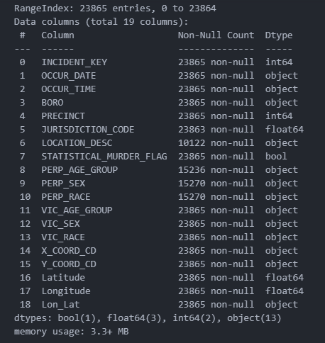

# A Data Analyst Solution to the Gun Violence Crisis.

## Introduction.

In the United States, hate crimes and shooting incidents have increased, sparking a divisive national debate on gun control laws. To develop effective police enforcement and intervention strategies, it is essential to gain a thorough understanding of criminal activity through statistical analysis, summarization, and insights derived from data sources, such as the [New York City Shooting Incidents dataset](https://www.kaggle.com/thedataperson/nypd-shooting-incident-data-20062021/download). Features such as shooting location, date, time, the shooter's and/or victim's age, gender, and race are all interesting aspects to explore for the purpose of offering solutions to the gun crisis. Data analysis reveals a concerning increase in gun violence on American streets, rendering them less safe and necessitating an urgent solution, therefore, there are specific areas requiring significant improvements to address the gun crisis in the United States effectively.

Image 1 : Summary of the DataFrame.

## Here’s a summary of trends in the dataset;

- There is a significant amount of missing data regarding perpetrators.
- The high frequency of shootings in Brooklyn could be attributed to its status as the most populous borough in New York City.
- 18-24 and 25-44 age brackets comprise individuals who are most prone to committing gun violence.
- Most incidents occur during the nighttime.
- Brooklyn has the highest incidence rate.

## Area with the Most Occurrences.

While there are numerous possibilities with this dataset, it is essential to narrow down the focus to key aspects, such as identifying regions with the highest frequencies, in order to simplify the extraction of valuable insights. Areas with the most occurrences are essential because insights from such features have implications that can reduce these occurrences. Understanding the factors contributing to these incidents in these areas can inform strategies to lower or prevent incidents in other areas, thereby benefiting law enforcement and policymakers.

> The analysis will focus on locations that have the highest frequency of incidents, hence the reason for the narrowing down.

## Area with the Fewer incidences.

- Examining areas with fewer incidents could be just as crucial because there may be measures implemented to maintain low figures.

